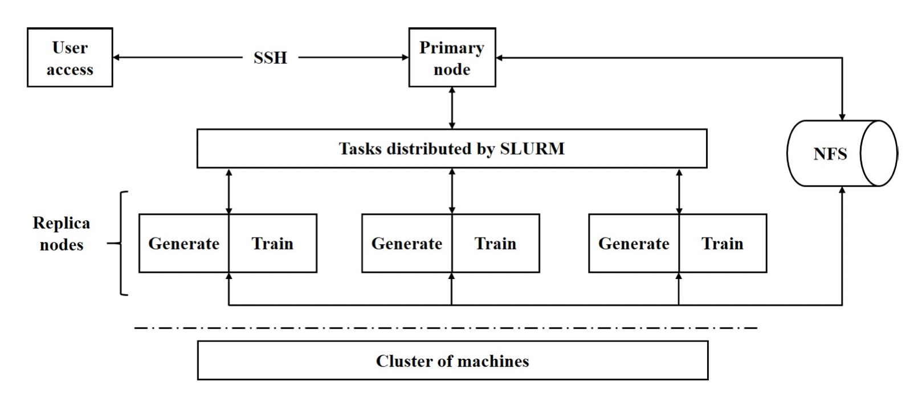

# AI Benchmark调研

人工智能技术已经在我们生活中的方方面面为我们提供服务，尤其是在图像、视频、语音、推荐系统等方面带来了突破性成果。AI Benchmark旨在衡量AI模型的性能和效能。本文就AI Benchmark的困难与挑战、发展现状，以及新兴的边缘计算领域的EDGE AI Benchmark发展现状进行了分析总结。

## AI Benchmark困难与挑战

深度学习技术可以利用有限的数据逼近高维函数。但我们仍未掌握模型参数、系统配置对机器学习、深度学习算法的学习动态的影响。目前AI Benchmark领域的困难与挑战总结如下：

1. **学习动态难解释：** 深度学习技术一定程度上是一个高维非凸优化问题，细微的变化会导致不同的优化路径，严重依赖参数调整的经验。
2. **成本高昂：** 在我们开启一次训练之后，我们必须完整的跑完整个训练过程。完整训练一次GPT-3模型的成本约7500万人民币。
3. **指标问题：** 在时间质量(Time to Quality, TTQ)指标上，时间质量严重依赖超参数的调整，同时需要解耦架构、系统和算法评估模块；在每秒浮点运算次数(floating-point operations per second, FLOPS)上，有半精度浮点、单精度浮点、双精度浮点、多精度浮点、混合浮点等浮点类型。
4. **需求冲突：** 主要问题为1.组件基准(component benchmarks)无法在模拟器上运行，2.维基准(Micro benchmarks)可负担，但不能模拟学习动态。
5. **有效期问题：** 人工智能模型的演变和变化往往会超过人工智能基准。
6. **可拓展性问题：** AI问题的规模是固定的，不可拓展。
7. **可重复性问题：** 基准测试要求测试是可复现的，神经网络的随机性会影响基准测试的复现性。神经网络中的随机性包括：随机种子、模型初始化、数据增强、数据Shuffle、Dropout等等。

## AI & EDGE AI Benchmark总览

| 发布者                             | 名称               | 领域             | 负载类型                                                                          | 指标                                                                 | 用于分布式协同AI                               | 链接                                                                                                                                                                                                                             |
| ---------------------------------- | ------------------ | ---------------- | --------------------------------------------------------------------------------- | -------------------------------------------------------------------- | ---------------------------------------------- | -------------------------------------------------------------------------------------------------------------------------------------------------------------------------------------------------------------------------------- |
| Bench Council                      | AIoT Bench         | 端侧推理         | 图像分类                                                                          | 每秒算力、吞吐量                                                     | 不涉及云端,范式覆盖不足                        | [官网](https://www.benchcouncil.org/aibench/aiotbench/index.html "https://www.benchcouncil.org/aibench/aiotbench/index.html")                                                                                                          |
| Bench Council                      | AI Bench           | 云端训练         | 目标检测、图像分类、图像生成、推荐系统、语音识别、机器翻译、3D目标重建            | 时间、算力、功率、性能                                               | 不涉及边侧，不涉及系统,范式覆盖不足            | [官网](https://www.benchcouncil.org/aibench/index.html "https://www.benchcouncil.org/aibench/index.html")                                                                                                                              |
| Bench Council                      | Edge AI Bench      | 边端推理         | 图像分类、目标检测人脸/语音识别、Re-ID                                            | 延迟、吞吐量、能耗、准确率                                           | 不涉及云端，范式覆盖不足                       | [官网](http://www.benchcouncil.org/aibench/edge-aibench/index.html "http://www.benchcouncil.org/aibench/edge-aibench/index.html")                                                                                                      |
| 中国人工智能产业发展联盟（AIIA）   | AIIA DNN Benchmark | 边/云推理        | 图像分类、目标检测、语义分割、超分辨率、机器翻译、语音识别、推荐系统              | 吞吐量、延迟、功耗比、每瓦算力比、精度损失比、芯片利用率、单价算力比 | 覆盖模型不涉及系统，范式覆盖不足，测评样本较少 | [官网](http://aiiaorg.cn/benchmark/zh/index.html "http://aiiaorg.cn/benchmark/zh/index.html")                                                                                                                                          |
| 百度                               | DeepBench          | 云端训练边端推理 | 1. 通用负载：GEMM, Conv, RNN1. 应用负载：机器翻译、语音识别、计算机视觉、语言建模 | 延迟，每秒算力                                                       | 社区不活跃，测试样本老旧，范式覆盖不足         | [github](https://github.com/baidu-research/DeepBench "https://github.com/baidu-research/DeepBench")                                                                                                                                    |
| 英伟达、Harvard、Stanford、Google  | MLPerf             | 云端训练边端推理 | 图像分类、目标检测、图像分割、语音识别、机器翻译、强化学习、推荐系统              | 吞吐量、达到一定精度所需要的时间                                     | 不涉及边侧性能测量，范式覆盖不足               | [官网](https://www.nvidia.com/en-us/data-center/resources/mlperf-benchmarks/ "https://www.nvidia.com/en-us/data-center/resources/mlperf-benchmarks/")                                                                                  |
| NVIDIA                             | Jetson Benchmarks  | 边端推理         | 目标检测、姿态估计、语义分割、NLP                                                 | 吞吐量                                                               | 不涉及云端, 范式覆盖不足                       | [官网](https://developer.nvidia.com/embedded/jetson-benchmarks#:~:text=Jetson%20Benchmarks.%20Jetson%20is%20used%20to%20deploy%20a,estimation%2C%20semantic%20segmentation%2C%20and%20natural%20language%20processing%20%28NLP%29.) |
| 清华大学、鹏城实验室、中科院计算所 | AIPerf             | 云端训练边侧推理 | 图像分类                                                                          | 每秒算力、GPU/内存利用率                                             | 聚焦大规模AI集群，不涉及边侧，范式覆盖不足     | [github](https://github.com/AI-HPC-Research-Team/AIPerf)                                                                                                                                                                            |

## AIoTBench

[github地址](https://github.com/BenchCouncil/AIoTBench) | [官网]() | [论文]()

Bench Council发布的AIoT Bench是一个基准套件，AIoTBench专注于评估移动和嵌入式设备的推理能力，包含三个典型的重量级网络：ResNet50、InceptionV3、DenseNet121以及三个轻量级网络：SqueezeNet、MobileNetV2、MnasNet。每个模型都由三个流行的框架实现：Tensorflow Lite、Caffe2、Pytorch Mobile。对于Tensorflow Lite中的每个模型，还提供了三个量化版本：动态范围量化(dynamic range quantization)、全整数量化(full integer quantization)、float16量化(float16 quantization)。

AIotBench中使用模型的FLOPs、Parameters和准确率

在框架的选择上，AIoTBench支持了三个流行和具有代表性的框架：Tensorflow Lite、Caffe2、Pytorch Mobile。

最后，在指标上，AIoTBench通过VIPS(Valid Images Per Second, 每秒有效图像)来反映得分。

AIotBench中VIPS计算

目前，Bench Council已经发布了Android版本的AIoTBench，它包含四个模块：

1. 配置模块：用户可以配置模型文件的路径和数据集的路径。预处理参数由文件配置。我们在默认路径中提供了数据集、准备的模型和相应的预处理配置。添加新型号很方便。用户只需要i）准备模型文件并放入模型路径，ii）在配置文件中添加该模型的预处理设置。
2. **预处理模块：**读取和预处理图像。
3. **预测模块：**由于不同的框架有不同的推理API，AIoT Bench抽象了两个接口，并为三个框架实现它们：Tensorflow Lite、Caffe2、Pytorch Mobile。prepare()接口负责加载和初始化模型，infer()接口负责执行模型推理。当用户需要添加新的框架时，只需要根据新框架实现对应的两个API接口即可。
4. **评分模块：**记录每次测试的准确性和推断时间，并计算最终的AI基准测试分数。

## AI Bench

AI Bench是Bench Council在2018年提出的适用于数据中心、HPC、边缘和 AIoT 的综合 AI 基准测试套件，提出了一种场景提取的基准测试方法论和企业级AI基准测试框架和套件。测试数据源有公共开源数据集和经过保密脱敏处理的合作机构的数据集。

### AI Bench系统架构

AI Bench系统架构

AI Bench框架分为数据输入、AI问题域、离线训练、在线推理四个部分。

数据输入(data input)模块：负责将数据输入其他模块，支持结构化、半机构化、非结构化数据，例如表格、图形、文本、图像、音频、视频等等。同时，数据输入模块集成了各种开源数据存储系统，支持大规模数据生成和部署。

AI问题域：AI Bench确定了最重要的AI问题领域，针对这些领域的AI算法的具体实现作为组件基准(component benchmarks)。并对组件基准中最密集的计算单元实现为一组微基准(micro benchmarks)。组件基准和微基准可以自由组合，每个基准也都可以独立运行。

离线训练(offline training)和在线推理(online inference)模块：构建端到端(End-to-End)的应用程序基准。首先，离线训练模块通过指定所需的基准ID、输入数据和批量大小等执行参数，从AI问题域模块中选择一个或多个组件基准。然后离线训练模块训练一个模型并将训练好的模型提供给在线推理模块。在线推理模块将训练好的模型加载到推理服务中，与关键路径中的其他非AI模块协作，构建端到端应用程序基准。

为了在大规模集群上轻松部署，框架提供了部署工具，提供了Ansible和Kuberneres的两个自动化部署模板。Ansible主要提供的是在物理机或者虚拟机上的1+N复制模式，Kubernetes需要提前构件好集群，在Master节点上通过配置文件将配置下发至各个节点从而完成部署。

## Edge AI Bench

Edge AI Bench是一个基于场景的基准套件，是AI Bench场景基准的一部分，设置了4个典型的边缘AI场景：自动驾驶、ICU患者监控、智能家居、智能家居。Edge AI Bench提供了一个端到端的应用程序基准框架，包括训练、验证和推理阶段。

Edge AI Bench涵盖的场景、模型、数据集情况如下表所示。

| 名称         | 场景        | 模型              | 数据集                          | 框架             |
| ------------ | ----------- | ----------------- | ------------------------------- | ---------------- |
| 车道检测     | 自动驾驶    | LaneNet           | Tusimple, CULane                | Pytorch/Caffe    |
| 交通标志检测 | 自动驾驶    | Capsule Network   | German Traffic Sign Recognition | Keras            |
| 死亡预测     | ICU患者监控 | LSTM              | MIMIC-III                       | Tensorflow/Keras |
| 呼吸困难预测 | ICU患者监控 | LSTM              | MIMIC-III                       | Tensorflow/Keras |
| 表型分类     | ICU患者监控 | LSTM              | MIMIC-III                       | Tensorflow/Keras |
| 行人重识别   | 监控摄像头  | DG-Net            | Market-1501                     | PyTorch          |
| 动作识别     | 监控摄像头  | ResNet18          | UCF101                          | PyTorch/Caffe    |
| 人脸识别     | 智能家居    | FaceNet/SphereNet | LFW/CASIA-Webface               | Tensorflow/Caffe |
| 语音识别     | 智能家居    | DeepSpeech2       | LibriSpeech                     | Tensorflow       |

## AIIA DNN benchmark

[官网](http://aiiaorg.cn/benchmark/zh/index.html)

AIIA DNN benchmark项目由中国人工智能产业发展联盟计算架构与芯片推进组发起。AIIA DNN benchmark项目是用于测试具有机器学习处理能力的加速器或处理器硬件、软件以及服务的训练和推理性能的开源基准平台。它能帮助人工智能研究人员采用通用标准来衡量用于训练或推理任务的人工智能硬件、软件的最佳性能。旨在客观反映当前以提升深度学习处理能力的 AI 加速器现状，为芯片企业提供第三方评测结果，帮助产品市场宣传；同时为应用企业提供选型参考，帮助产品找到合适其应用场景的芯片。

### AIIA DNN benchmark系统架构

### AIIA DNN benchmark评测路线

AIIA DNN benchmark依据行业应用，区分垂直应用场景对深度神经网络加速器/处理器展开基于真实应用场景的基准测试工作。

### AIIA DNN benchmark评测场景与指标

| 场景                   | 模型                | 测试指标                                                                  | 数据集     |
| ---------------------- | ------------------- | ------------------------------------------------------------------------- | ---------- |
| Object Classification  | ResNet50ResNet152   | fps / top1 / top5 / latency / Throughput /power / (frame/sec/w)           | ImageNet   |
| Object Detection       | SSD                 | fps / mAP / latency / Throughput / power /(frame/sec/w)                   | PASCAL-VOC |
| Image Segmentation     | TBD                 | TBD                                                                       | TBD        |
| Image Super Resolution | TBD                 | TBD                                                                       | TBD        |
| Recommender Systems    | NCF                 | (samples/sec) / topN / coverage / latency / Throughpu                     | MovieLens  |
| Machine Translation    | BERT-BASEBERT-LARGE | (sentences/sec) / BLEU / latency / Throughput / power / (sentences/sec/w) | Wikipedia  |
| Speech Recognition     | TBD                 | TBD                                                                       | TBD        |

## 百度DeepBench

[github](https://github.com/baidu-research/DeepBench)

DeepBench 的主要目的是在不同硬件平台上对对深度学习很重要的操作进行基准测试。尽管深度学习背后的基本计算很容易理解，但它们在实践中的使用方式却出奇的多样化。例如，矩阵乘法可能是计算受限的、带宽受限的或占用受限的，这取决于被相乘的矩阵的大小和内核实现。由于每个深度学习模型都使用这些具有不同参数的操作，因此针对深度学习的硬件和软件的优化空间很大且未指定。

DeepBench直接使用神经网络库（cuDNN, MKL）对不同硬件上基本操作的性能进行基准测试。它不适用于为应用程序构建的深度学习框架或深度学习模型。

### DeepBench测试方法

DeepBench 由一组基本操作（密集矩阵乘法GEMM、卷积Conv）以及一些循环神经网络RNN类型组成。DeepBench的测试包括七个硬件平台的训练结果，NVIDIA 的 TitanX、M40、TitanX Pascal、TitanXp、1080 Ti、P100 和英特尔的 Knights Landing。推理结果包括三个服务器平台，NVIDIA 的 TitanX Pascal、TitanXp 和 1080 Ti。三款移动设备 iPhone 6 和 7、RaspBerry Pi 3 的推理结果也包括在内。

DeepBench提供多种芯片的测试方法，共有以下5种类型：

1. NVIDIA Benchmarks：需指定MPI_PATH、CUDA_PATH、CUDNN_PATH、NCCL_PATH、GPU数量、精度类型等，通过编译后，可以运行基准测试。
2. Baidu Benchmarks：需指定MPI_PATH、CUDA_PATH、BAIDU_ALLREDUCE_PATH、GPU数量等参数，之后使用mpirun运行Baidu All-Reduce基准测试。
3. Intel Benchmarks：需要指定Intel工具icc、mkl、mpi路径，可以进行GEMM、Conv、ALL-Reduce等基准测试。
4. ARM Benchmarks：需要在64位ARM v8处理器上编译和运行ARM Benchmarks，可以进行GEMM、Conv、稀疏GEMM基准测试。
5. AMD Benchmarks：需要支持ROCm的平台、rocBLAS、MIOpen等组件，可以进行Conv、RNN、GEMM基准测试。

## MLPerf

[官网](https://www.nvidia.com/en-us/data-center/resources/mlperf-benchmarks/)

MLPerf是一个由来自学术界、研究实验室和行业的人工智能领导者组成的联盟。

MLPerf的训练测试由八个不同的工作负载组成，涵盖了各种各样的用例，包括视觉、语言、推荐和强化学习。

| 训练阶段项目       | 模型        | 数据集               |
| ------------------ | ----------- | -------------------- |
| 图像分类           | ResNet v1.5 | ImageNet             |
| 物体检测（轻量级） | SSD         | COCO 2017            |
| 物体检测（重量级） | Mask R-CNN  | COCO 2014            |
| 医学图像分割       | UNet-3D     | KiTS1                |
| 语音自动识别       | RNN-T       | Librispeech          |
| 自然语言处理       | BERT        | Wikipedia 2020/01/01 |
| 推荐系统           | DLRM        | Criteo 1 TB          |
| 强化学习           | Mini Go     |                      |

MLPerf推理测试七种不同神经网络的七个不同用例。其中三个用例用于计算机视觉，一个用于推荐系统，两个用于自然语言处理，一个用于医学成像。

| 推理阶段项目       | 模型                 | 数据集      |
| ------------------ | -------------------- | ----------- |
| 图像分类           | ResNet v1.5          | ImageNet    |
| 物体检测（轻量级） | SSD-MobileNet-v1SS   | COCO 2017   |
| 物体检测（重量级） | Mask R-CNN, 1.44 MP | COCO 2014   |
| 医学图像分割       | UNet-3D              | BraTS 2019  |
| 语音自动识别       | RNN-T                | Librispeech |
| 自然语言处理       | BERT                 | SQuAD v.1.1 |
| 推荐系统           | DLRM                 | Criteo 1 TB |

## Jetson Benchmarks

[官网](https://developer.nvidia.com/embedded/jetson-benchmarks#:~:text=Jetson%20Benchmarks.%20Jetson%20is%20used%20to%20deploy%20a,estimation%2C%20semantic%20segmentation%2C%20and%20natural%20language%20processing%20%28NLP%29.) | [github](https://github.com/NVIDIA-AI-IOT/jetson_benchmarks)

Jetson Benchmarks是通过高性能推理将各种流行的DNN模型和ML框架部署到边缘侧Jetson设备中，以实时分类和对象检测、姿势估计、语义分割和自然语言处理（NLP）等任务作为工作负载，检测边缘侧Jetson设备性能的基准测试工具。

针对各类Jetson设备，Jetson Benchmarks的脚本会自动运行如下配置的基准测试，并得到测试结果（FPS）

* Names : Input Image Resolution
* Inception V4 : 299x299
* ResNet-50 : 224x224
* OpenPose : 256x456
* VGG-19 : 224x224
* YOLO-V3 : 608x608
* Super Resolution : 481x321

## AIPerf

[github](https://github.com/AI-HPC-Research-Team/AIPerf) | [论文](https://arxiv.org/abs/2008.07141)

AIPerf Benchmark由鹏城实验室、清华大学等团队联合提出。AIPerf Benchmark基于微软NNI开源框架，以自动化机器学习（AutoML）为负载，使用network morphism进行网络结构搜索和TPE进行超参搜索。

AIPerf官方提供四种数据集： Flowers、CIFAR-10、MNIST、ImageNet-2012 前三个数据集数据量小，直接调用相关脚本自动会完成下载、转换（TFRecord格式）的过程。

AIPerf为了保证基准测试结果有效，要求测试需要满足如下条件：

1. 测试运行时间应不少于1小时；
2. 测试的计算精度不低于FP-16；
3. 测试完成时所取得的最高正确率应大于70%；

AIPerf的工作流如下：

1. 用户通过SSH登陆主节点，收集集群内Replica nodes的信息并创建SLURM配置脚本
2. 主节点通过SLURM将工作负载分派到对应于请求和可用资源的Replica nodes中，分发的过程是并行且异步的
3. 各个Replica nodes接收工作负载并执行架构搜索和模型训练
4. Replica nodes上的CPU根据当前历史模型列表搜索新架构，其中包含详细的模型信息和测试数据集的准确性，然后将候选架构存储在缓冲区（如NFS）中以供后续训练
5. Replica nodes上的AI加速器加载候选架构和数据集，利用数据并行性和HPO一起训练，然后将结果存储在历史模型列表中
6. 一旦满足条件（如达到用户定义的时间），运行终止，根据记录的指标计算最终结果后得出基准测试报告

